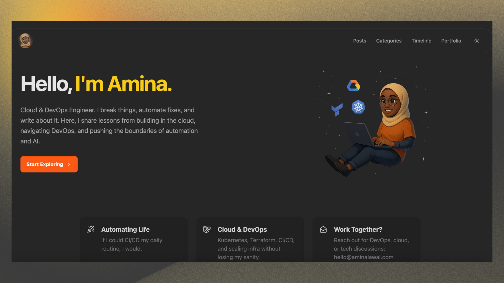

# A personal blog built with Astro

A clean, responsive blog template built with Astro and Tailwind CSS. Easily customizable with minimal frontend knowledge required.

## Features

- 🐈 Simple And Beautiful
- 🖥️️ Responsive And Light/Dark mode
- 🐛 SiteMap & RSS Feed
- 🐝 Category and Timeline Support
- 🍋 Google Analytics & Google Structured Data
- 🐜 SEO and Responsiveness
- 🍋 Markdown And MDX
- 🏂🏾 Page Compression & Image Optimization

## Getting Started

### Deploy to Vercel

### Build from Source

1. Clone this repository `git clone git@github.com:Amiynarh/aminalawal-blog.git`
2. Execute `pnpm install` to install dependencies.
3. Modify the `src/config.ts` file to customize your blog.
4. Execute `pnpm run dev`: Starts a local development server with hot reloading enabled.

### Development Commands

With dependencies installed, you can utilize the following npm scripts to manage your project's development lifecycle:

- `pnpm run dev`: Starts a local development server with hot reloading enabled.
- `pnpm run preview`: Serves your build output locally for preview before deployment.
- `pnpm run build`: Bundles your site into static files for production.

For detailed help with Astro CLI commands, visit [Astro's documentation](https://docs.astro.build/en/reference/cli-reference/).

## License

This project is released under the MIT License. Please read the [LICENSE](LICENSE) file for more details.
